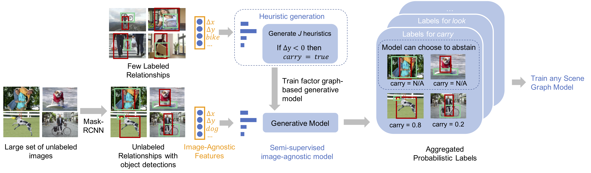

# Scene Graph Prediction with Limited Labels

## Overview

* Scene graphs capture visual relationships between objects in images, e.g. `<person, riding, bike>`. They have emerged as useful in a number of computer vision tasks, including visual quetsion answering and captioning.
* However, most scene graph datasets are spare due to annotator error!
* This work attempts to overcome limitations of human annotators using a semi-supervised method, takeing advantage of both limited labels and unlabeled data, to **generate training datasets for scene graphs**.

* Approach:
    * We leverage _image-agnostic features_, which are _cheap_ to extract given bounding box pairs of images.
    * With as few as `n=10` labeled relationships per predicate (e.g. "walk", "ride", "eat"), we learn _heuristics_, shallow decision trees that can serve as _noisy labelers_.
    * Because these heuristics are error prone, we learn a _generative model_ to combine and denoise the outputs of these heuristics, producing _probabilistic labels_ for each object pair.
    * Using probabilistic labels over the unlabeled training data, we can bootstrap training for any downstream scene graph model!




### Paper
You can find the full paper corresponding to this work, presented at ICCV 2019, at https://arxiv.org/abs/1904.11622.

### Bibtex

Please refer to the following citation if you are building on this work:
```
@inproceedings{Chen_2019_ICCV,
    author = {Chen, Vincent S. and Varma, Paroma and Krishna, Ranjay and Bernstein, Michael and Re, Christopher and Fei-Fei, Li},
    title = {Scene Graph Prediction With Limited Labels},
    booktitle = {The IEEE International Conference on Computer Vision (ICCV)},
    month = {October},
    year = {2019}
}
```

## Setup
Please run the following script to download the [VisualGenome](visualgenome.org) dataset.
```
./scripts/get_visualgenome.sh
```

To create the virtual environment with appropriate requirements:
```
virtualenv -p python3 .env
source .env/bin/activate
pip install -r requirements.txt
```

## Demo
All instructions for this demonstration are included in `main.ipynb`.

## Contributions
Feel free to open an issue or send an email if you have any questions!

